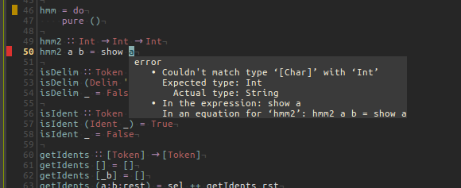
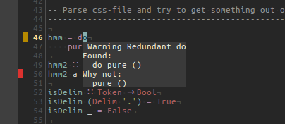
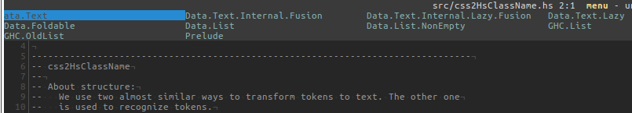

# kakoune-haskellutils

This is in WIP-mode, please, do not try to use atm (29th sep 2018). This
works only partially with recent kakoune-versions.


These scripts provide basic commands to use haskell linters
[hlint](https://github.com/ndmitchell/hlint) 
and 
[hdevtools](https://github.com/hdevtools/hdevtools).

The scripts are based on the [lint.kak](https://github.com/mawww/kakoune/blob/master/rc/base/lint.kak).

## Usage

Currently provided commands are:
- hlint-enable
- hdevt-enable
- hlint-disable
- hdevt-disable
- hlint
- hdevt
- hlint-next-error
- hdevt-next-error
- hlint-previous-error
- hdevt-previous-error
- hdevt-findsymbol

To make mappings, put the following into `kakrc` and rethink the letters
at the same time.  To see the flags on the left of the screen, enabling 
is needed.  Otherwise, running and then next/prev is enough.
```
map -docstring "Run hlint" global user h :hlint<ret>
map -docstring "Run hdevtools check" global user H :hdevt<ret>

map -docstring "Enable hlint" global user e :hlint-enable<ret>
map -docstring "Enable hdevtools" global user E :hdevt-enable<ret>

map -docstring "Next hlint warning/suggestion" global user n :hlint-next-error<ret>
map -docstring "Next hdevtools error" global user N :hdevt-next-error<ret>

map -docstring "Prev hlint warning/suggestion" global user p :hlint-previous-error<ret>
map -docstring "Prev hdevtools error" global user P :hdevt-previous-error<ret>
```





There is basic support for `hdevtools findsymbol` command. For some
reason, the first character is lost...  Now, by selecting a module from
the list, it will be inserted into the code followed by .-character.




## Installation 

```
git clone https://github.com/gspia/kakoune-haskellutils
```
and then add `hlint.kak` to your autoload directory,
`~/.config/kak/autoload`, or source it manually.  And similarly for 
the `hdevtools.kak`.

## Caveats

These are the first versions (as of March 2018), and both scripts 
include smelly code
and they haven't been tested properly etc. 

These have been not tested with really long error messages.


## TODO

Both tools have several command line parameters.

- add ways to user given cmd-line parameters for the tools
- find out better common default cmd-line parameters
- add support for the other cmds (like `hdevtools type`) 
- add a user-mode thing
- an example how to automatically run these tools, say, on file save.


